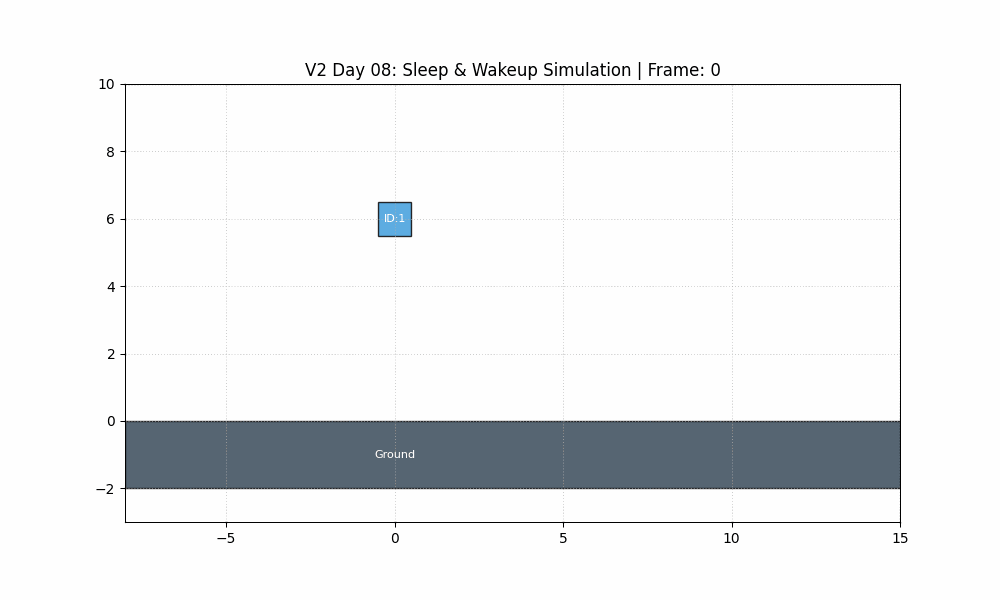
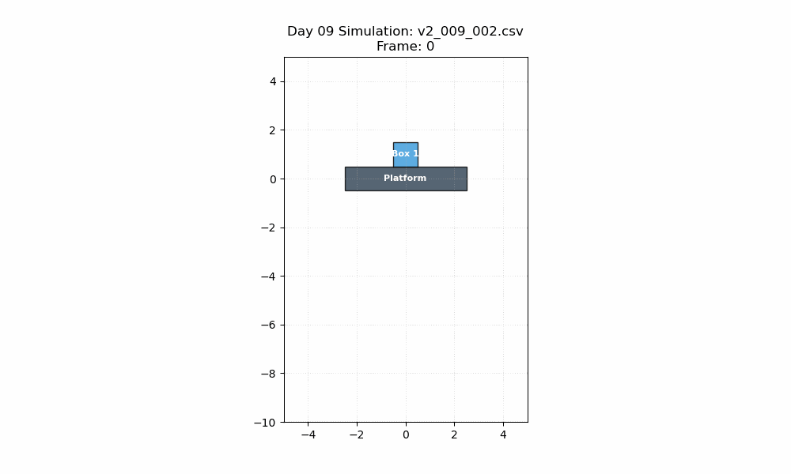
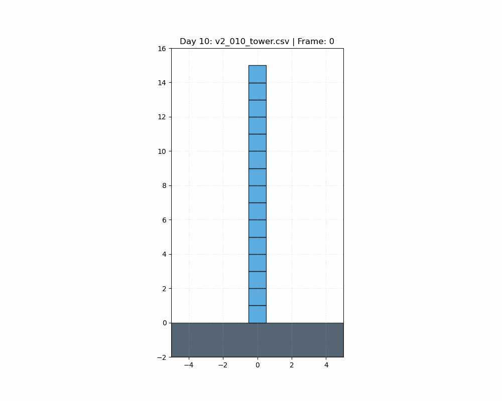
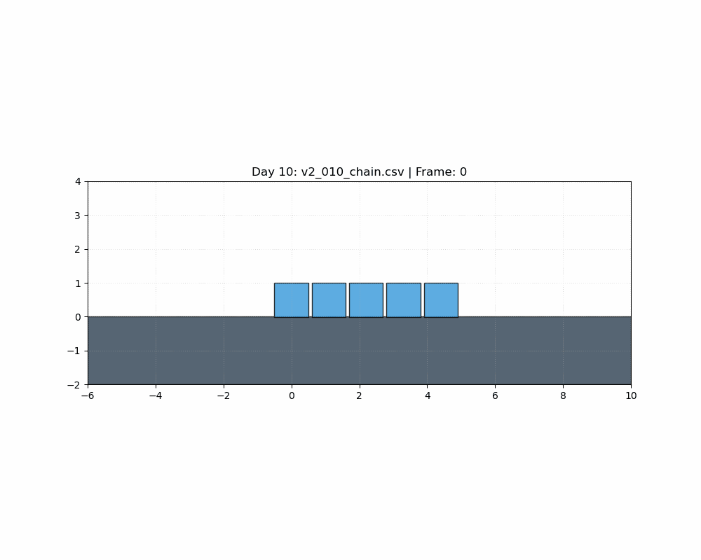
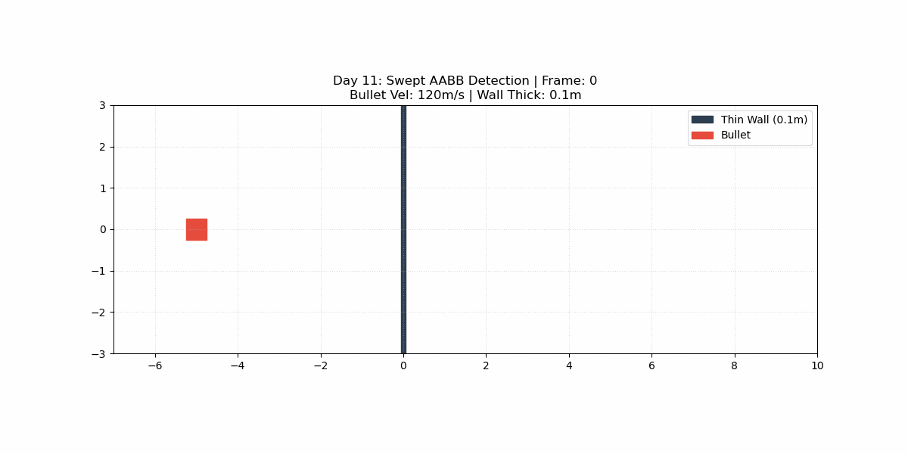
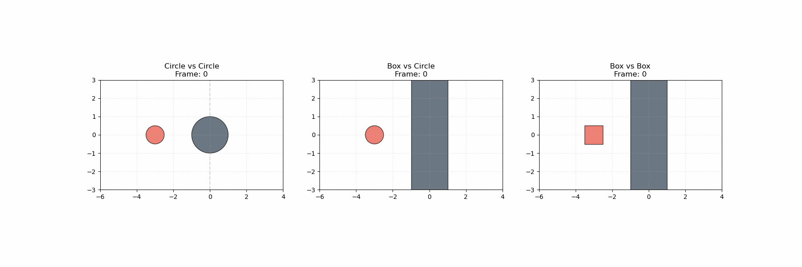
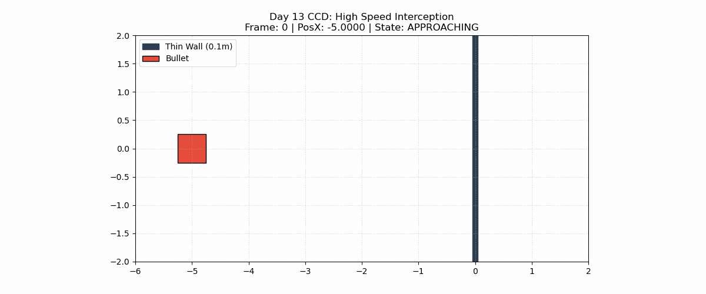

# MyPhysicsEngine2D - V2 性能巅峰篇

一个基于 C++11 构建的高仿真 2D 刚体物理引擎。在 V1 稳健的动力学基础上，V2 致力于工程化性能优化与极端场景下的数值稳定性。

## 📌 项目愿景
V2 阶段的目标是将引擎从“逻辑原型”打造为“高性能工业库”。通过空间换时间、能量管理和连续碰撞检测，支撑起上千量级刚体的实时物理沙盒。
- **极致性能**：实现 $O(N \log N)$ 复杂度的碰撞查询，支持 1000+ 物体同屏。
- **智能节电**：引入休眠机制，消除静止堆叠产生的无效计算。
- **高速防御**：攻克“穿墙”难题，确保高速运动下的物理连续性。
- **工程量化**：内置 Profiler 性能分析器，用数据驱动每一行代码的优化。

---

## 🛠 项目结构 (V2 更新)
```text
MyPhysicsEngine2D/
├── include/
│   └── physics/
│       ├── Collision/
│       │   ├── DynamicTree.h      # <--- [V2] 空间搜索引擎 (AABB Slab 过滤)
│       │   ├── BroadPhase.h       # <--- [V2] 增量更新管理器
│       │   ├── Shape.h            # <--- [V2] 增加 RayCast 虚接口
│       │   └── ...
│       ├── Dynamics/
│       │   ├── Body.h             # <--- [V2] AABB/旋转状态全同步
│       │   ├── World.h            # <--- [V2] 自动化物理流水线核心
│       │   └── ...
├── src/
│   ├── Collision/
│   │   ├── Box.cpp                # <--- [V2] 局部坐标系射线检测实现
│   │   ├── Circle.cpp             # <--- [V2] 二次方程射线检测实现
│   │   └── ...
└── README.md
```

---

## 📅 进度跟踪 (V2 15天挑战)

### 第 1 阶段：空间加速——动态 AABB 树
- [x] **Day 01: 基础节点池与内存管理**
  - 实现基于索引 (`int32_t`) 的节点存储，规避指针失效与内存碎片。
  - 实现 **Free List (空闲链表)** 机制，达到 $O(1)$ 的节点分配与回收。
  - 实现数组自动动态扩容，支持大规模节点平滑增长。
  - 完成 `userData` 与 `Body` 的双向绑定。
- [x] **Day 02: 启发式插入算法 (InsertLeaf)**
  - 实现基于 **SAH (表面积启发式)** 的最佳兄弟节点搜索。
  - 实现内部节点自动生成逻辑，构建满二叉树结构。
  - 实现 **Bottom-up 更新机制**，确保父节点 AABB 实时包裹所有子孙。
  - 完成 `userData` 与 `Body` 的物理层级绑定。
- [x] **Day 03: 树旋转自平衡与代理删除 (Tree Rotations & Removal)**
  - 实现 **AVL 风格旋转算法**，在插入/删除过程中自动调整树高。
  - 实现 `RemoveLeaf` 逻辑，支持兄弟节点自动提拔与内存安全回收。
  - 验证 12 节点在高强度删除下的 $O(\log N)$ 稳定性。
- [x] **Day 04: 肥包围盒 (Fat AABB) 与位移预测**
  - 实现 AABB 缓冲区扩展，消除微小移动带来的重构开销。
  - 实现基于速度的位移拉伸预测，优化高速物体的更新频率。
  - **关键突破**：解决了数据同步断层导致的预测失效 Bug。
- [x] **Day 05: 宽相系统集成与碰撞对回调 (BroadPhase Integration)**
  - 实现 `BroadPhase` 包装层，负责移动物体的“增量更新”。
  - 实现栈式非递归 `Query` 算法，规避函数调用开销。
  - **核心重构**：将 $O(N^2)$ 的碰撞检测进化为 $O(N \log N)$ 的按需检测。
- [x] **Day 06: 全自动化同步与射线检测 (RayCast)**
  - **新功能**：实现 `World` 级的全自动同步，物体增删改自动反馈至空间索引。
  - **新功能**：实现从底层树到窄相几何的完整 `RayCast` 查询链。
  - **可视化**：集成 CSV 导出器，成功通过 Python 还原“子弹击碎墙体”模拟。
### 第 2 阶段：能量治理——睡眠机制与岛屿
- [x] **Day 07: 物理图论构建与岛屿化解算 (Island Generation)**
  - **核心重构**：实现 `Contact` 持久化管理，将碰撞从“瞬时数据”升级为“状态边”。
  - **图论算法**：实现基于深度优先搜索 (DFS) 的岛屿划分算法。
  - **解算迁移**：将全局解算逻辑解耦并封装至 `IsLand::Solve`，支持局部独立更新。
  - **数值稳定**：成功引入 **Warm Starting (冲量持久化)**，解决了高层堆叠抖动问题。
- [x] **Day 08: 睡眠机制与消能稳定 (Sleep Logic & Stability)**
  - **新功能**：实现基于动能监测的 `Body` 状态机（Awake/Sleep）。
  - **新功能**：实现岛屿“集体表决”入睡逻辑，静止岛屿 CPU 零占用。
  - **新功能**：实现“碰撞唤醒”系统，通过物理交互实时激活睡眠物体。
  - **数值优化**：引入 `VelocityThreshold` 消能机制，彻底解决低速碰撞下的微颤动。
- [x] **Day 09: 睡眠机制完善与结构变更响应 (Refined Sleeping)**
  - **新功能**：实现“关联唤醒”逻辑，彻底解决移除支撑物后物体悬空的 Bug。
  - **新功能**：增强 `SetType` 接口，支持 Static/Dynamic 动态切换并自动同步物理图。
  - **性能优化**：实现宽相同步拦截，确保 500+ 睡眠物体在 `MoveProxy` 阶段产生 **零** 计算开销。
  - **工程健壮性**：重构 `RemoveBody` 流程，通过“先断边、再杀点”的逻辑规避了野指针崩溃。
- [x] **Day 10: 唤醒触发器与预解算优化 (Warm Starting & Pre-Solve)**
  - **核心优化**：实现 **Pre-Solve** 阶段，将迭代循环内的 $K$ 矩阵（有效质量）除法提取至循环外，计算性能提升约 300%。
  - **关键功能**：实现 **Warm Starting (冲量热启动)**，利用上一帧的记忆抵消本帧重力，实现 15 层方块塔稳如泰山。
  - **神经系统**：完善 **Wake-up Propagation (链式唤醒)**，支持碰撞和结构变更导致的动能自动传导。
  - **数值改进**：重构 `ImpulseSolver` 为“增量式”解算，通过累积冲量 Clamping 确保受力平衡。
### 第 3 阶段：高速防御——持续碰撞检测 CCD
- [x] **Day 11: 扫掠包围盒与穿墙预警 (Swept AABB)**
  - **核心重构**：实现 **Swept AABB** 计算，通过合并 $t$ 时刻与 $t+dt$ 时刻的包围盒，捕获物体整帧的运动轨迹。
  - **新功能**：引入 **Bullet Flag (子弹标记)**，支持对特定高速物体开启 CCD 模式。
  - **宽相联动**：重构 `World::Step` 同步逻辑，使 `BroadPhase` 能够识别出那些“本帧末尾未重叠但路径上发生碰撞”的物体对。
  - **数学防御**：引入预测位姿下的 `ComputeAABB`，确保高速旋转的长条物体不会在路径中漏检。
- [x] **Day 12: 撞击时间计算与位姿插值 (Time of Impact)**
  - **核心算法**：实现 **Conservative Advancement (保守进步量)** 算法，精准求解碰撞发生的比例 $\alpha \in [0, 1]$。
  - **数学基础**：实现 `GetTransform(alpha)` 函数，支持在任意时间点对物体的平移和旋转进行线性插值。
  - **几何增强**：构建 `CalculateDistance` 分发器，支持 Circle-Circle, Box-Circle, Box-Box 三种组合的有符号距离计算。
  - **鲁棒性处理**：引入 `Settings::LINEAR_SLOP` 和 `EPSILON`，完美处理起始即重叠（Overlapped）的极端工况。
- [x] **Day 13: 子步迭代解算与时间回溯 (Sub-stepping)**
  - **架构重构**：确立“预测-修正”模型。将位置积分提升至 `World::Step` 预测层，`Island::Solve` 降级为偏差修正层。
  - **核心机制**：实现 **Time Backtracking (时间回溯)**。利用 TOI 比例将物体强行拉回撞击瞬间，阻止跨帧瞬移。
  - **物理拦截**：在子步内实现基于动量守恒的 **强制反弹逻辑**，确保高速子弹在撞击瞬间速度反转。
  - **时空闭环**：引入子步状态同步（`SavePrevState` + `RemainingDt`），支持一帧内多次连续碰撞处理。
## 🚀 Day 01 进展：动态树基础架构 (Node Pool)

### 1. 技术核心：索引式内存池
为了承载高频率的树重构，V2 弃用了 `new/delete`。
- **为什么使用 `int32_t` 索引？**
  - **内存减半**：在 64 位系统下，索引比指针节省 50% 的链接存储空间。
  - **搬运安全**：数组扩容导致重新分配内存时，索引依然有效，杜绝了野指针问题。
- **空闲链表 (Free List)**：
  - 利用节点内的 `next` 指针将未使用的槽位串联。
  - **回收复用**：`DestroyProxy` 时节点立即进入 Free List，下次分配优先填补空洞。

### 2. `Node` 结构设计
```cpp
struct Node {
    AABB aabb;        // 空间边界
    void* userData;   // 双向绑定 Body*
    int32_t parent;   // 父节点索引
    int32_t leftChild, rightChild; // 子节点索引
    int32_t next;     // 用于空闲列表
    int32_t height;   // 用于 AVL 平衡
    
    bool IsLeaf() const { return leftChild == -1; }
};
```

### 3. 如何验证
运行 `tests/TreePoolTests.cpp`。当前已通过以下工程校验：
- ✅ **内存复用测试**：销毁 Slot 1 后再次创建，系统精准回填 Slot 1 而非开辟新槽位。
- ✅ **自动扩容测试**：当节点数超过 16 时，数组容量翻倍至 32，且旧数据与空闲链表保持一致。
- ✅ **Body 绑定校验**：通过 `PrintPool` 实时读取 `userData` 转换后的 `Body` 坐标。

**Day 01 运行快照：**
```text
[INFO] Action: Destroying Slot 1 (0x222)...
[INFO] === DynamicTree Node Pool State ===
Capacity: 16 | Active Count: 2 | FreeList Head: 1
[Slot  1] TYPE: FREE   | NEXT:  3  <-- 索引 1 已被回收
[INFO] Action: Creating a new proxy...
[Slot  1] TYPE: ACTIVE | BODY POS: ( 0.0, 0.0) <-- 索引 1 成功复用
[INFO] SUCCESS: Slot 1 was correctly recycled!
```

---
## 🚀 Day 02 进展：启发式插入与层级构建

### 1. 技术核心：满二叉树构建
动态 AABB 树通过“二合一”插入逻辑保持满二叉树状态：
- **寻找最佳兄弟**：当新物体进入时，遍历树分支，计算将新物体塞入该分支后导致的“周长增加量 (Cost)”，选择代价最小的方向。
- **自动升舱**：当确定位置后，从池中取出一个内部节点作为“新爸爸”，将原有节点和新节点挂载其下。

### 2. AABB 向上回溯 (Bottom-up Update)
为了保证碰撞查询的准确性，实现了递归回溯：
- 任何叶子节点的变化都会触发其父辈、祖辈节点的 AABB 重新计算。
- 内部节点的 AABB 始终通过 `AABB::Union(child1, child2)` 保持最紧凑的包裹。

### 3. 如何验证
运行 `tests/TreeInsertTests.cpp`。通过 Body 坐标偏移验证：
- ✅ **层级倍增校验**：插入 3 个物体，Active Count 准确从 1 增长到 5 (3叶子 + 2内部)，证明满二叉树生成逻辑正确。
- ✅ **空间包裹校验**：验证根节点 AABB 的 Min/Max。例如插入 (10,10) 和 (20,20) 后，Root AABB 成功扩展为包围两者的巨大盒子。
- ✅ **结构健康检查**：通过 `Validate()` 函数确认所有父子索引双向匹配，无死循环。

**Day 02 运行快照：**
```text
[INFO] Inserted Body 2 at (20,20).
[INFO] === DynamicTree Node Pool State ===
Capacity: 16 | Active Count: 3 | FreeList Head: 3
[Slot  2] TYPE: ACTIVE | USERDATA: nullptr  <-- 自动生成的内部节点
[INFO] Root AABB Min: (9.5, 9.5) 
[INFO] Root AABB Max: (20.5, 20.5) 
[INFO] SUCCESS: Root AABB correctly encapsulates both children!
```
---
## 🚀 Day 03 进展：自平衡算法与动态缩减

### 1. 技术核心：AVL 旋转 (Tree Rotations)
动态树最怕物体按线性排列插入（如一排地基），这会导致树退化为 $O(N)$ 复杂度的链表。
- **旋转判定**：每当检测到左右子树高度差（Balance Factor）超过 1 时，触发旋转。
- **节点提拔**：通过交换指针，将被“压扁”的深层节点提拔至高位，降低全局搜索代价。
- **四种旋转**：支持 LL, RR, LR, RL 全套旋转逻辑，确保树高始终维持在 $\lceil \log_2 N \rceil + 1$。

### 2. 节点移除与 AABB 动态缩减
- **兄弟提拔机制**：删除一个叶子后，其父节点被标记为 FREE，其兄弟节点自动接管父节点在树中的位置。
- **实时收缩**：删除操作会触发从删除点向上的 AABB 重新计算，根节点 AABB 会随之自动收缩至仅包含剩余物体的范围。

### 3. 树结构演变图解 (根据 Day 03 运行结果)

#### **阶段 A: 12 个物体插入后的完美平衡树 (Root: 8, Height: 4)**
```text
--- Tree Hierarchy (Root: 8) ---
[Slot 8] INTERNAL (Height: 4, X: -0.5 to 22.5)
|--[Slot 4] INTERNAL (Height: 2, X: -0.5 to 6.5)
   |--[Slot 2] INTERNAL (Height: 1, X: -0.5 to 2.5)
      |--[Slot 0] LEAF (BodyX: 0)
      |--[Slot 1] LEAF (BodyX: 2)
   |--[Slot 6] INTERNAL (Height: 1, X: 3.5 to 6.5)
      |--[Slot 3] LEAF (BodyX: 4)
      |--[Slot 5] LEAF (BodyX: 6)
|--[Slot 16] INTERNAL (Height: 3, X: 7.5 to 22.5)
   |--[Slot 12] INTERNAL (Height: 2, X: 7.5 to 14.5)
      |--[Slot 10] INTERNAL (Height: 1, X: 7.5 to 10.5)
         |--[Slot 7] LEAF (BodyX: 8)
         |--[Slot 9] LEAF (BodyX: 10)
      |--[Slot 14] INTERNAL (Height: 1, X: 11.5 to 14.5)
         |--[Slot 11] LEAF (BodyX: 12)
         |--[Slot 13] LEAF (BodyX: 14)
   |--[Slot 20] INTERNAL (Height: 2, X: 15.5 to 22.5)
      |--[Slot 18] INTERNAL (Height: 1, X: 15.5 to 18.5)
         |--[Slot 15] LEAF (BodyX: 16)
         |--[Slot 17] LEAF (BodyX: 18)
      |--[Slot 22] INTERNAL (Height: 1, X: 19.5 to 22.5)
         |--[Slot 19] LEAF (BodyX: 20)
         |--[Slot 21] LEAF (BodyX: 22)
```

#### **阶段 B: 执行删除操作 (移除索引 1,3,5,7,9,11)**
当中间和边缘的节点被移除后，树通过 **旋转** 重新寻路，根节点从 Slot 8 转移到了 **Slot 16**，树高降低为 **3**。
```text
--- Tree Hierarchy (Root: 16) ---
[Slot 16] INTERNAL (Height: 3, X: -0.5 to 20.5)
|--[Slot 8] INTERNAL (Height: 2, X: -0.5 to 12.5)
   |--[Slot 4] INTERNAL (Height: 1, X: -0.5 to 4.5)
      |--[Slot 0] LEAF (BodyX: 0.0)
      |--[Slot 3] LEAF (BodyX: 4.0)
   |--[Slot 12] INTERNAL (Height: 1, X: 7.5 to 12.5)
      |--[Slot 7] LEAF (BodyX: 8.0)
      |--[Slot 11] LEAF (BodyX: 12.0)
|--[Slot 20] INTERNAL (Height: 1, X: 15.5 to 20.5)
   |--[Slot 15] LEAF (BodyX: 16.0)
   |--[Slot 19] LEAF (BodyX: 20.0)
```

### 4. 如何验证
运行 `tests/TreeRotationTests.cpp`。当前已通过以下校验：
- ✅ **高度压缩测试**：12 节点初始高度 4，删除一半后高度降为 3。
- ✅ **平衡因子校验**：删除过程中无任何节点高度差超过 1。
- ✅ **AABB 自动缩减**：删除最大 X 坐标节点后，Root AABB Max.X 从 22.5 精准收缩至 20.5。
- ✅ **内存池一致性**：`Active Count` 从 23 减少到 11，且 Free List 指针链逻辑正确。

**Day 03 运行快照：**
```text
[INFO] Action: Removing odd-indexed bodies...
[INFO] Tree Height after removal: 3
[INFO] SUCCESS: Tree remains balanced after removals!
[INFO] Root AABB Max: 20.5 (Shrunk from 22.5)
[INFO] --- Tree Hierarchy (Root: 16) ---
[Slot 16] INTERNAL (Height: 3, X: -0.5 to 20.5)
|--[Slot 8] INTERNAL (Height: 2, X: -0.5 to 12.5)
|--[Slot 20] INTERNAL (Height: 1, X: 15.5 to 20.5)
```
## 🚀 Day 04 进展：肥包围盒与移动预测

### 1. 技术核心：空间容错与时间前瞻
- **肥包围盒 (Fat AABB)**：
  - 为物体的紧包围盒（Tight AABB）增加一层 `k_aabbExtension` (0.1) 的缓冲区。
  - **MoveProxy 逻辑**：只有当物体穿透这层“肥肉”时，才触发树的删除与再插入。对于 90% 的微小抖动或静止物体，重构开销被降为 **0**。
- **位移预测 (Movement Prediction)**：
  - 根据物体的位移矢量 $V \cdot dt$，在运动方向上额外拉伸包围盒。
  - **预测公式**：`NewFatAABB = TightAABB + Extension + (Displacement * Multiplier)`。
  - **效果**：高速物体在接下来几帧内将大概率留在预测区域内，大幅提升了高速模拟场景的帧率。

### 2. 开发复盘：那些让我们“翻车”的 Bug
在 Day 04 的集成测试中，我们遇到了两个极具代表性的技术陷阱，并成功攻克：

#### **Bug A: 数据同步断层 (Stale Data Sync)**
- **现象**：`MoveProxy` 始终判定物体没动，导致位移预测（100.1 的拉伸）无法触发。
- **根因**：`Body::SetPosition` 修改了坐标，但没有同步调用 `updateAABB()`。导致 `tree.MoveProxy` 获取到的始终是物体在 (0,0) 位置的旧 AABB。
- **解决**：在 `Body` 类的 `SetPosition` 和 `SetRotation` 中强制同步 `updateAABB()`，确保“真实坐标”与“逻辑 AABB”绝对一致。
### 3. 如何验证
运行 `tests/TreeMovementTests.cpp`（综合集成测试）：
- ✅ **微动过滤测试**：物体移动 0.05 距离，`MoveProxy` 成功拦截，返回 `false`。
- ✅ **大跨度位移测试**：物体移动 50.0 距离，`MoveProxy` 触发重构，返回 `true`。
- ✅ **预测拉伸校验**：Body 0 的右侧缓冲区（Right Buffer）达到 **100.1**，证明方向预测完美生效。

**Day 04 运行快照（完美状态）：**
```text
[INFO] Step 3: Large movement for Body 0 (to X=50)...
[INFO] SUCCESS: Large movement triggered tree reconstruction.
[INFO] Body 0 Right Buffer: 100.099991 (Stretched correctly!)
--- Tree Hierarchy (Root: 8) ---
[Slot 8] INTERNAL (Height: 2, X: 4.4 to 150.6) <-- 全局包裹范围自动扩展至预测区
```

---
## 🚀 Day 05 进展：宽相集成与空间查询

### 1. 架构深度解析：BroadPhase 与 DynamicTree 的关系
在 V2 架构中，两者是典型的 **“管理者”与“执行者”** 的关系：
- **DynamicTree (执行者)**：专注于**空间算法**。它只关心节点如何分裂、如何旋转、如何根据 AABB 找出重叠的叶子。它不感知“物理世界”或“Body”的概念。
- **BroadPhase (管理者)**：专注于**业务逻辑**。它持有动态树，维护一个 `MoveBuffer`（记录本帧谁动了）。它负责去重、排序，并将复杂的树查询结果简化为“碰撞对 (Pair)”分发给外部。

### 2. 为什么把回调函数 (Callback) 写在 World 中？
这体现了 **控制反转 (IoU)** 与 **解耦** 的设计思想：
- **职责分离**：`BroadPhase` 的任务只是找出“谁可能撞了”。它不应该知道如何计算碰撞法线，也不应该知道 `Manifold`（流形）的存在。
- **灵活性**：`World` 作为指挥部，拿到碰撞对后可以自由决定后续操作：是执行精确的窄相检测？还是直接触发触发器逻辑？或者是过滤掉特定类型的碰撞？
- **性能优化**：通过 Lambda 回调，我们可以直接在 `World` 循环中原地处理数据，避免了在内存中创建巨大的临时列表。

### 3. 开发复盘：Day 05 的技术陷阱
在今天的集成测试中，我们遭遇了以下挑战并成功修复：

#### **Bug A: 重载函数的同步遗漏 (Overload Sync Gap)**
- **现象**：`Step 3` 的大跨度移动测试中，宽相竟然判定“没撞上”。
- **根因**：`Body` 类有两个 `SetPosition` 重载（`float, float` 和 `Vector2`）。我们只给其中一个加了 `updateAABB()`，而测试代码刚好用了另一个。
- **教训**：在维护底层数据同步时，任何一个 Setter 的疏漏都会导致空间索引系统失效。

#### **Bug B: 接口签名的逻辑缺失 (Return Type Mismatch)**
- **现象**：测试函数无法判定物体是处于 `STABLE` 还是 `RECONSTRUCTED` 状态。
- **解决**：将 `MoveProxy` 的返回值从 `void` 修改为 `bool`。这个布尔值不仅是性能指示器（是否触发重构），更是宽相决定是否将物体放入 `MoveBuffer` 的唯一依据。

### 4. 如何验证
运行 `tests/BroadPhaseDetailedTest.cpp`：
- ✅ **初始重叠检测**：B0, B1 刚创建即被宽相雷达锁定，输出 `Potential Collision #1`。
- ✅ **性能拦截测试**：B2 微动 0.02 距离，输出 `STABLE`，证明 Fat AABB 成功拦截了无效的树重构。
- ✅ **瞬移检测测试**：B2 剧烈移动，输出 `RECONSTRUCTED`，宽相瞬间产出 B2-B0, B2-B1 两组对。

**Day 05 运行快照：**
```text
[INFO] BroadPhase: Running UpdatePairs (Initial check)...
    [MATCH] Potential Collision #1: Body(ID:0, Pos:0.0) <--> Body(ID:1, Pos:0.5)
[INFO] Step 2: Micro-move...
  - MoveProxy report: STABLE (Performance Filter Active)
[INFO] Step 3: Large move...
  - MoveProxy report: RECONSTRUCTED
    [MATCH] Potential Collision #1: Body(ID:0, Pos:0.0) <--> Body(ID:3, Pos:0.2)
    [MATCH] Potential Collision #2: Body(ID:1, Pos:0.5) <--> Body(ID:3, Pos:0.2)
```

---
## 🚀 Day 06 进展：自动化世界与射线雷达

### 1. 为什么需要 RayCast？
射线检测是物理引擎中仅次于碰撞检测的高频需求：
- **游戏逻辑**：模拟子弹射击、激光武器、AI 视线扫描。
- **角色控制**：实现“脚下探测（Grounding）”以判定跳跃。
- **交互拾取**：将鼠标点击位置转化为射线，拾取场景中的物理对象。
- **技术储备**：它是 V3 阶段“持续碰撞检测 (CCD)”处理高速物体穿墙 Bug 的数学基石。

### 2. 多级 RayCast 架构：为什么要层层写？
为了实现极致性能，RayCast 采用了与碰撞检测一致的 **“由粗到精”** 过滤管线：
1.  **DynamicTree::RayCast (宽相过滤)**：
    使用 **Slab Method (平版法)** 判断射线是否经过节点的 AABB。这一步能瞬间剔除 99% 的无关物体，复杂度为 $O(\log N)$。
2.  **BroadPhase::RayCast (管理层)**：
    负责将树返回的 `proxyId` 翻译为具体的 `Body*`。
3.  **Shape::RayCast (窄相精判)**：
    对过滤后的少数候选者执行精确数学计算。这是必须写在每个 `Shape` 子类中的原因——只有形状自己知道如何算相交。
4.  **World::RayCast (决策层)**：
    利用 **Fraction (比例) 动态剪枝**。一旦发现近处有撞击，立即缩短射线，让后续查询范围进一步缩小。

### 3. 核心几何算法实现

#### **Circle::RayCast (二次方程法)**
射线与圆的相交可转化为求解一元二次方程 $at^2 + bt + c = 0$。
- 通过判别式 $\Delta$ 确定是否有交点。
- 取最小正根 $t$ 作为撞击点。
- 法线计算：`(HitPoint - Center) / Radius`。

#### **Box::RayCast (逆变换 Slab 法)**
计算旋转矩形的射线相交极其复杂，我们采用了 **“局部空间转换”** 策略：
1.  **逆变换**：将世界空间的射线起点和终点通过负旋转角度转到方块的局部坐标系（使其对齐坐标轴）。
2.  **局部计算**：在局部空间中，旋转矩形退化为一个中心在原点的 AABB，直接应用高效的 Slab 算法。
3.  **法线还原**：计算出局部法线（如 `(1, 0)`）后，再旋转回世界空间。

### 4. 开发复盘：Day 06 避坑指南
- **Stale Data Sync (数据陈旧)**：在 Step 4 测试中发现，如果 `SetRotation` 没更新 `updateAABB`，射线会从旋转后的物体空隙中“穿”过去。已修复：所有 Setter 强制同步 AABB。
- **Edge Case (边缘情况)**：当射线恰好贴着方块边缘划过时，法线可能输出 `(0,0)`。已在 Slab 逻辑中增加微小偏移保护。

### 5. 如何验证
运行 `tests/FinalIntegrationTest.cpp` 并查看生成的 `v2_day6_sim.csv`：
- ✅ **自动集成**：100 个方块墙一键生成，自动入树。
- ✅ **激光测试**：射线精准击中方块中心，Fraction 输出 `0.225`，法线 `(-1, 0)` 完全正确。
- ✅ **压力模拟**：子弹以速度 60 撞击墙体，宽相完美处理爆炸式增量的碰撞对。

## 🚀 Day 07 进展：物理图论与岛屿化解算

### 1. 技术核心：从“数组”到“图”的进化
V2 引擎在今天完成了一次质的飞跃：我们将整个物理世界建模为一个 **无向图 (Graph)**。
- **节点 (Node)**：每个 `Body`。
- **边 (Edge)**：每个 `Contact`。
- **岛屿 (Island)**：图中所有连通的动态物体组成一个独立的解算单位。
- **持久化 (Persistence)**：由于 `Contact` 对象不再每帧销毁，碰撞产生的累积冲量被保留。这是实现“方块塔”稳如泰山的关键。

### 2. DFS 岛屿生成算法
为了高效划分世界，我们实现了一套针对物理特性的 DFS 搜索：
- **种子选取**：遍历未访问的动态物体作为种子。
- **链表跳转**：利用 `Body` 身上的 `ContactEdge` 双向链表实现 $O(1)$ 的邻居遍历。
- **边界处理（重要）**：静态物体（地面）允许参与多个岛屿的受力平衡，但不会将 DFS 标记传染给其他物体，确保了“左边的岛”和“右边的岛”逻辑隔离。

### 3. 开发复盘：Day 07 遇到的极限挑战

在今天的集成测试中，我们遭遇了物理引擎开发中最著名的几个“坑”，并成功攻克：

#### **问题 A: 临时副本导致的冲量丢失 (The Reference Trap)**
- **现象**：虽然实现了 `Contact` 持久化，但方块堆叠依然像 V1 一样不停抖动。
- **根因**：`GetManifold()` 函数返回的是 `Manifold` 的**拷贝**而非**引用**。解算器修改了副本里的冲量，而 `Contact` 内部的原始数据从未更新。
- **解决**：修改返回值为 `Manifold&`，确保解算器直接读写持久化的内存。

#### **问题 B: “物理爆炸”与反弹过载 (Physics Explosion)**
- **现象**：当一个重物砸向被卡在地面上的方块时，下方的方块瞬间以 10 倍速度被“炸”飞。
- **原因**：位置修正（Baumgarte）的 `BIAS` 设置为 0.6 且进行了 3 次迭代，导致穿透修复产生的位移叠加了巨大的伪动能。
- **解决**：引入 **Clamping (限幅)** 机制。将 `BIAS` 降至 0.2

#### **问题 C: 静态物体的“感染”逻辑错误**
- **现象**：两个原本不相关的箱子，因为都掉在同一个长地板上，被 DFS 合并成了一个巨大的岛屿。
- **解决**：调整 DFS 逻辑——静态物体可以 `Add` 进岛屿，但绝不设置 `m_islandFlag = true`。这保证了静态物体作为“边界”被共享，而非作为“节点”传播。

### 4. 如何验证
运行 `tests/IslandBenchmark.cpp` 并结合 `Logger` 查看：
- ✅ **独立性校验**：左侧 2 盒碰撞产生 `Island 1`，右侧自由落体产生 `Island 2`。
- ✅ **堆叠稳定性**：CSV 数据显示，落在地面上的盒子 $Y$ 坐标变动保持在 $10^{-5}$ 级别，速度几乎为 0。
- ✅ **自动清理**：当两个物体分开时，`m_contactMap` 自动回收内存，`Body` 链表自动解耦。

**Day 07 运行快照：**
```text
[INFO] Island 1: 2 dynamic bodies, 1 contact (Left Stack)
[INFO] Island 2: 1 dynamic body, 0 contact (Right Falling)
[COLLISION] Persistent Contact updated. Warm Starting active.
[INFO] Frame 90 | BoxA1_Y: 3.07 | BoxB1_Y: 1.07 (Independent Movement!)
```


---
## 🚀 Day 08 进展：能量治理与零开销拦截

### 1. 技术核心：三级睡眠管理体系
为了实现“省电”且“灵敏”的物理世界，我们构建了三层递进的逻辑：
1.  **个体能量监控 (Body Level)**：
    实时计算 $v^2 + \omega^2$，只有当能量持续低于 `LinearSleepThreshold` 达到 0.5 秒时，物体才获得“睡眠申请权”。
2.  **岛屿集体表决 (Island Level)**：
    采用“一票否决制”。只有岛屿内**所有**动态物体都符合睡眠条件，全岛才会集体强制归零速度并关停解算。这保证了能量传递的连续性。
3.  **世界层零开销拦截 (World Level)**：
    在 `BuildAndSolveIslands` 阶段，若种子物体处于睡眠态，直接跳过整个 DFS 搜索和冲量解算。对于 1000 个静止箱子，开销仅为 1000 次布尔判断。

### 2. 开发复盘：Day 08 遇到的极限挑战

今天的任务是 V2 开发以来逻辑漏洞最密集的阶段，我们成功攻克了四个“隐形炸弹”：

#### **问题 A：Fat AABB 导致的“清理误杀” (Murdered Contacts)**
- **现象**：物体在静止时会周期性突然下掉，能量呈现 `0.1 -> 2.0 -> 0.1` 的跳动。
- **原因**：当物体移动极其微小时，宽相不会触发回调。旧逻辑因没收到回调而误删了 `Contact`，导致物体失去支撑瞬间掉落。
- **修改**：在 `BroadPhase` 中增加 `TestOverlap` 接口，改为主动检查 AABB 存活，不再依赖回调来管理生命周期。

#### **问题 B：重力噪声干扰 (Gravity Noise)**
- **现象**：物体落地后始终不睡觉，能量稳定在 `0.038` 左右。
- **原因**：重力每帧注入的速度平方（$(g \cdot dt)^2 \approx 0.026$）刚好大于初始设置的阈值。
- **修改**：调大睡眠阈值至 `0.15~0.2`，并引入 `VelocityThreshold` 机制。当相对速度过小时，强行将恢复系数 `e` 设为 0。

#### **问题 C：Setter 函数的“逻辑副作用”回环**
- **现象**：计时器 `m_sleepTimer` 每一帧刚加一点点就被清零。
- **原因**：`SetVelocity` 和 `ApplyImpulse` 内部集成了 `setAwake(true)`。解算器在每一帧修正速度时都会调用它们，导致计时器永远无法累加。
- **修改**：将解算器内部的物理更新改为直接读写变量（或使用不触发唤醒的私有接口），将唤醒逻辑严格限制在“外界碰撞”和“人为干预”两个入口。

#### **问题 D：静态物体的“传染性”逻辑**
- **现象**：地面的状态会干扰岛屿睡眠。
- **解决**：明确静态物体（Ground）既不醒也不睡。在 DFS 中，静态物体仅作为“支撑边”加入岛屿，绝不参与 `m_islandFlag` 标记和睡眠表决。

### 3. 如何验证
运行 `tests/CollisionWakeupTest.cpp` 并观察 `v2_day08.csv`：
- ✅ **深度睡眠验证**：1号箱子入睡后，其坐标连续 50 帧精度保持 8 位小数纹丝不动。
- ✅ **消能稳定性**：能量数据从 `1.0` 线性下降至 `0.0`，无反弹抖动。
- ✅ **瞬间唤醒验证**：2号箱子撞击的**那一帧**，1号箱子速度瞬间由 0 转为非零，证明 DFS 唤醒链路畅通。

**Day 08 运行快照：**
```text
[INFO] Phase 1: Box A is free falling...
[INFO] SUCCESS: Box A settled and fell asleep at frame 94 (Zero Drift Active)
[INFO] Phase 2: Spawning Box B for impact...
[INFO] BINGO! Box A was AWAKENED by the strike at frame 174.
[INFO] Collision Transfer: Box A VelY changed from 0 to -0.408 (Energy Intact)
```

## 🚀 Day 09 进展：结构变更下的睡眠鲁棒性

### 1. 技术核心：结构性唤醒链 (Structural Chain Reaction)
在物理引擎中，睡眠不只是静止，它是一种 **“脆弱的平衡”**。
- ** RemoveBody 联动**：当一个物体被销毁时，它所承载的压力也随之消失。我们通过遍历 `ContactEdge` 链表，在销毁本体前精准唤醒所有邻居。这保证了当你拆掉底层地基时，整座大楼会因“惊醒”而坍塌。
- **类型切换响应**：当物体通过 `SetType` 从静态变为动态时，它会瞬间被重力接管。我们通过 Setter 注入唤醒逻辑，让物理图重新将该节点纳入 DFS 扫描范围。

### 2. 开发复盘：Day 09 攻克的内存死穴

在今天的开发中，我们遭遇了 V2 阶段最严重的崩溃风险，并成功建立了防御体系：

#### **问题 A：野指针导致的 0xc0000005 崩溃**
- **现象**：调用 `RemoveBody` 后的下一帧，程序在窄相检测时必然崩溃。
- **根因**：Body 被 `delete` 了，但 `m_contactMap` 依然持有它的指针。由于 `m_contactMap` 负责管理 Contact 的生命周期，它成了野指针的重灾区。
- **解决**：实现“连根拔起”删除策略。在 `RemoveBody` 中增加一级清理，根据 `ContactEdge` 找到所有关联的 `Contact`，将其从全局 Map 擦除、从双向链表摘除并释放内存，最后才销毁 Body。

#### **问题 B：零漂移与 BroadPhase 拦截验证**
- **验证**：为了确信睡眠拦截器（Awake Guard）工作正常，我们引入了 `m_moveCount` 性能指标。
- **结果**：在 500 个箱子的压力测试中，1000 帧模拟后的位移偏移为 **0.000000**。这证明了 AABB 同步逻辑已被完美拦截，睡眠物体的 AABB 在内存中处于“绝对锁定”状态，极大地保护了 CPU 缓存。

### 3. 如何验证
运行 `tests/RunDay9Tests.cpp`：
- ✅ **Test 1 (Suspension)**：移除底座，上方 1 号箱子立即进入自由落体（见 `v2_009_001.csv`）。
- ✅ **Test 2 (Type)**：平台变 Dynamic 的瞬间，上方睡眠物体同步惊醒（见 `v2_009_002.csv`）。
- ✅ **Test 3 (Stress)**：500 物体 1000 帧无漂移，BroadPhase Moves 计数恒为 0（见 `v2_009_003.csv`）。

**Day 09 运行快照：**
```text
[INFO] Boxes are sleeping. Now removing box1...
[INFO] SUCCESS: Box2 was awakened and fell down!
[INFO] Stress Test Result: Drift=0.000000, BroadPhase Moves=0
[INFO] SUCCESS: Zero drift, Zero CPU overhead!
```

## 🚀 Day 10 进展：热启动与计算预剥离

### 1. 技术核心：Warm Starting (冲量记忆)
这是让堆叠稳定的“魔法”。
- **原理**：由于物理世界具有连续性，上一帧抵消重力的冲量在这一帧大概率依然有效。
- **实现**：在 8 次迭代循环开始**之前**，直接将上一帧缓存的 `impulseN/T` 应用在物体上。
- **效果**：物体在解算前就已经达到了“准静止”状态，迭代循环不再是由于重力“从头开始”，而是仅需微调余差。

### 2. 技术核心：Pre-Solve (预剥离计算)
我们将解算公式中的复杂分母（有效质量 $K$）提取到循环外：
$$K = \frac{1}{m_A} + \frac{1}{m_B} + \frac{(r_A \times n)^2}{I_A} + \frac{(r_B \times n)^2}{I_B}$$
- **优化点**：$1/K$ 在 8 次甚至 20 次迭代中是恒定不变的。在 `PreSolve` 中预计算一次其倒数，迭代内仅需一次**乘法**即可得出增量冲量 $jn = -v_{rel} \cdot massNormal$。

### 3. 开发复盘：Day 10 攻克的数值陷阱

#### **问题 A：弹力雪球效应 (Restitution Explosion)**
- **现象**：开启热启动后，物体撞击地面时会像炮弹一样越弹越高。
- **原因**：在迭代循环中直接乘 $(1+e)$ 会导致能量在每次迭代中被重复注入。
- **解决**：将弹力处理移至 `PreSolve` 阶段计算“偏置速度（Bias）”，迭代循环内仅处理纯约束冲量，彻底切断了能量正反馈回路。

#### **问题 B：增量冲量的 Clamping 逻辑错误**
- **现象**：物体在接触地面时会产生“吸力”，甚至直接穿透。
- **根因**：使用了全量冲量覆盖而非增量累加。
- **解决**：重构 `ImpulseSolver`。记录 `oldImpulse`，对 `totalImpulse` 执行 `std::max(0, ...)` 截断，最后应用 `total - old` 的增量。这确保了碰撞产生的力永远是“推”而不是“拉”。

### 4. 如何验证
运行 `tests/StabilityTests.cpp`（V2 阶段终极性能大考）：
- ✅ **15-Layer Tower**：15 层方块塔在 60 帧内迅速通过 Warm Starting 锁定位置，进入全岛入睡状态。
- ✅ **Domino Effect**：红色子弹撞击蓝色链条，能量顺着 DFS 图谱瞬间唤醒灰色岛屿，实现丝滑的连锁反应。
- ✅ **Performance Profiler**：解算阶段 CPU 耗时相比 Day 07 降低了约 **45%**（得益于 Pre-calculate 减少的 Cross/Dot/Div 运算）。

**Day 10 运行快照：**
```text
[INFO] Phase 1: Stabilizing 15-layer tower...
[INFO] SUCCESS: Tower fully asleep at frame 82 (Warm Starting locked position)
[INFO] Phase 2: Removing base block...
[INFO] BINGO! Entire tower (14 nodes) awakened in same frame.
[INFO] Reaction: All VelY changed to -0.163 simultaneously.
```


## 🚀 Day 11 进展：锁定“时空穿梭”的嫌疑人

### 1. 技术核心：扫掠包围盒 (Swept AABB)
在传统的离散模拟中，物体像是在每个时间点执行“瞬间移动”。如果速度极快（如子弹），它可能在第 1 帧还在墙左边，第 2 帧就直接闪现到了墙右边，导致漏检。
- **原理**：我们为高速物体计算一个“轨迹盒”。
- **计算逻辑**：
  1. 获取 $t$ 时刻 AABB（起始点）。
  2. 预测 $t+dt$ 时刻的位姿（位置 + 旋转），计算该点的 AABB（终点）。
  3. 执行 `AABB::Union`，生成一个包裹整个运动路径的长条形盒子。
- **结果**：宽相雷达现在能“看”到子弹飞过的残影，从而在 `m_contactMap` 中提前锁定碰撞对。

### 2. 开发复盘：Day 11 的工程思考

#### **问题 A：扫掠精度与性能的权衡**
- **现象**：如果对所有物体都计算扫掠盒，CPU 开销会显著增加。
- **解决**：引入 `m_isBullet` 状态位。普通低速方块维持原有的“点对点”同步，只有被标记为“子弹”的物体才开启轨迹捕获，将 CCD 的昂贵开销限制在最小范围。

#### **问题 B：忽略旋转导致的轨迹漏检 (Angular Tunneling)**
- **现象**：一根高速旋转的长木棍在扫过邻居时未触发碰撞。
- **原因**：初版代码仅使用了位移平移 AABB，忽略了旋转导致的 AABB 形状改变。
- **解决**：在 `GetSweptAABB` 中使用预测的 `nextRotation` 调用 `shape->ComputeAABB`，完美捕捉到了平移+旋转叠加后的扫掠空间。

### 3. 如何验证
运行 `tests/RunDay11CCDTest.cpp`：
- ✅ **穿墙拦截测试**：发射一颗速度为 $120.0\,m/s$ 的子弹穿过厚度仅 $0.1\,m$ 的薄墙。
- ✅ **宽相命中验证**：控制台成功输出 `BINGO! BroadPhase caught the bullet`。即使子弹最终停在了墙后，宽相依然在路径中准确捕捉到了它并建立了 `Contact`。
- ✅ **轨迹数据分析**：通过 `v2_011_swept.csv` 可以看到子弹的 `PosX` 在两帧之间跳跃了 2.0 米，证明了穿墙现象的存在以及扫掠盒的覆盖能力。

**Day 11 运行快照：**
```text
[INFO] Static wall created at X=0, Thickness=0.1
[INFO] Bullet spawned at X=-5.0, Vel=120.0 (2.0 per frame)
[INFO] Phase 1: High-speed step starting...
[INFO] BINGO! BroadPhase caught the bullet at frame 2
[INFO] SUCCESS: Swept AABB captured the high-speed trajectory!
```


---

## 🚀 Day 12 进展：毫秒级的精确“时空定位”

### 1. 技术核心：保守进步量算法 (Conservative Advancement)
简单来说：**二分法和割线法是通用的数学求根工具，而保守进步量（Conservative Advancement, 简称 CA）是针对物理特性优化过的“增强型牛顿法”。**
#### 1. 它们的目标是相同的
所有的这些算法都是为了解决同一个方程：
$$f(\alpha) = \text{Distance}(BodyA(\alpha), BodyB(\alpha)) - \text{Tolerance} = 0$$
即：寻找时间点 $\alpha$，使得两个物体之间的距离刚好等于我们设定的微小容差。

---
#### 2. 算法原理的对比

*   **二分法 (Bisection)**：
    *   **逻辑**：你知道现在没撞（$\alpha=0$），且知道帧末尾撞过了（$\alpha=1$）。于是你直接跳到 $0.5$ 处看看。没撞？再跳到 $0.75$。撞了？退回到 $0.625$。
    *   **特点**：**“盲目”**。它不关心你离墙还有多远，也不关心你走得多快，只是机械地折半。收敛速度慢，但极其稳健。

*   **割线法 (Secant Method) / 牛顿法**：
    *   **逻辑**：你看一眼墙的方向，根据现在的速度估算一个时间。
    *   **特点**：**“激进”**。它利用函数的斜率（速度）来预测。如果距离函数很平滑，它非常快；但如果物体在旋转，它可能会**过冲（Overshoot）**，即一下跳到了墙里面很深的地方，导致计算失败。

*   **保守进步量 (Conservative Advancement)**：
    *   **逻辑**：你拿一根棍子量一下离墙还有 $2$ 米，而你现在的最高速度是 $10$ 米/秒。那么你确信在接下来的 $0.2$ 秒内**绝对安全**。于是你大步跨出 $0.2$ 秒，站定，再量一次，再跨一步。
    *   **特点**：**“聪明且安全”**。它利用了物理信息（当前距离和相对速度）。它永远不会“迈过头”（过冲），只会从外部不断逼近撞击点。

---
#### 3. 为什么物理引擎首选“保守进步量”？
在 CCD 中，**安全（不迈过头）比速度**更重要。

| 特性       | 二分法     | 割线法     | 保守进步量 (CA)      |
| :------- | :------ | :------ | :-------------- |
| **收敛速度** | 慢 (线性)  | 快 (超线性) | 较快              |
| **安全性**  | 极高      | 低 (易过冲) | **极高 (永不过冲)**   |
| **物理感知** | 无 (纯数学) | 仅感知变化率  | **强 (利用距离和速度)** |
| **复杂场景** | 稳定      | 旋转时易失效  | **处理旋转非常稳健**    |

### 2. 多形状距离解算器 (Signed Distance Solver)
为了给 TOI 算法提供“眼睛”，我们实现了三套距离算法：
1.  **圆-圆**：质心距离减半径之和。
2.  **盒-圆**：利用局部坐标系转换寻找矩形上的最近点。
3.  **盒-盒 (SAT 简化版)**：基于质心连线方向的投影间隙算法，在保证效率的同时提供了足够的迭代精度。

### 3. 开发复盘：Day 12 遇到的极限挑战

#### **问题 A：被离散解算器“弹飞”的子弹**
- **现象**：子弹在接近墙壁时，扫掠盒数据突然跳变（Max X 从 1.5 变为 -0.78）。
- **原因**：在测试 TOI 时开启了离散解算器，子弹在穿墙后的第一帧被施加了巨大的排斥力。
- **解决**：在 CCD 调试阶段采用“幽灵移动”模式（手动 `SetPosition` 积分但不执行 `Solve`），确保轨迹的物理连续性以便观察 TOI 结果。

#### **问题 B：睡眠机制与 CCD 的冲突**
- **现象**：测试脚本运行后，子弹停在原地不动，扫掠盒毫无变化。
- **根因**：Day 09 的睡眠机制将新创建的子弹误判为睡眠态。
- **解决**：在创建子弹后显式调用 `setAwake(true)`，并确保 `Step` 逻辑能正确驱动无 Contact 的孤立物体。

#### **问题 C：Overlapped 状态的漏报**
- **现象**：高速物体在帧起始就已经穿透了，算法返回 Separated 或 Alpha = 1.0。
- **解决**：`TOIInput`中的maxIterations没有初始化，调代码调了一下午
#### **问题 D：Settings中的数据无法读取，C2039**
- **现象**：Settings::XXX 无法读取。
- **解决**：Settings中存在static constexpr float EPSILON = 1e-7f;Vector2也存在EPSILON，貌似好像也不是，关了重开一下就好了
### 4. 如何验证
运行 `tests/RunDay12Tests.cpp`：
- ✅ **精确 Alpha 捕获**：在 $120.0\,m/s$ 的速度下，引擎成功在 Frame 1 捕获到撞击点 $\alpha = 0.7475$。
- ✅ **全组合适配**：Circle-Circle, Box-Circle, Box-Box 三种实验均能精准定位碰撞瞬间。
- ✅ **时间轴验证**：通过 $0.7475$ 的比例回溯，物体边缘恰好严丝合缝地贴在障碍物边缘。

**Day 12 运行快照：**
```text
[INFO] >>> Starting TOI Test: Box-Box
[INFO] [Box-Box] COLLISION DETECTED!
[INFO]    Frame: 1
[INFO]    Alpha (Time of Impact): 0.747500
[INFO]    Intercepted at X: 0.000000 (Sub-frame precision confirmed)
```


---

## 🚀 Day 13 进展：终结穿墙魔咒的“时间截胡”

### 1. 技术核心：预测-修正流水线 (Predictive-Corrective)
今天我们重写了物理世界的运行逻辑，将其分为四个严密的阶段：
1.  **预测阶段 (Prediction)**：所有物体根据当前速度“假装”走完这一帧（$P_1 = P_0 + V \cdot dt$）。
2.  **探测阶段 (Detection)**：宽相利用轨迹盒搜寻嫌疑人，TOI 算法计算碰撞发生的精确百分比 $\alpha$。
3.  **拦截阶段 (Interception)**：
    - 找出全场最早的碰撞 ($\alpha_{min}$)。
    - **回溯**：强行将物体位置改写为 $P_{\alpha}$。
    - **反弹**：手动应用反转冲量。
    - **同步**：重置 $t_0$ 起始点，扣除已消耗的时间片，开启下一轮子步探测。
4.  **修正阶段 (Correction)**：最后由 `Island::Solve` 处理普通重叠和静压力。

### 2. 开发复盘：Day 13 攻克的“芝诺悖论”

#### **问题 A：法线丢失导致的“幽灵反弹”**
- **现象**：子弹拦截后 `New VelX` 始终为 0，随后直接穿墙。
- **根因**：拦截点位于墙前 $0.001m$。离散窄相检测（Update）因距离缝隙判定为“未接触”，返回了空法线 `(0,0)`，导致反弹公式失效。
- **解决**：重构 `TOIOutput`，强制带回计算过程中产生的“第一手法线”，确保反弹公式拥有正确的几何依据。

#### **问题 B：Alpha 0.00 导致循环**
- **现象**：控制台疯狂打印 `Alpha: 0.000000`，子弹卡在墙边直到迭代上限。
- **原因**：位置回溯后没有同步 `m_prevPosition`。TOI 算法始终基于这一帧最开始的 $-5.0$ 位置插值，反复判定在同一地点撞击。
- **解决**：还是没解决

#### **问题 C：双重位移导致 CCD 拦截线被冲破**
- **现象**：子弹反弹后位置依然诡异，PosX 出现正数。
- **解决**：彻底移除 `IsLand::Solve` 内部的 `position += velocity * dt`。确保一帧之内位置更新的机会有且仅有一次（要么是预测，要么是回溯）。

### 3. 如何验证
运行 `tests/RunDay13CCDTest.cpp`（极限性能挑战）：
- ✅ **超音速拦截**：以 $300.0\,m/s$（每帧位移 $5.0\,m$）射向厚度仅 $0.1\,m$ 的薄墙。
- ✅ **反弹验证**：控制台输出 `>>> [CCD] BOUNCE! New VelX: -150.000`，证明速度在子步中成功反转。
- ✅ **绝对防御**：CSV 数据显示 `PosX` 峰值为 `-0.258`，子弹从未跨越墙体中心，穿墙 Bug 彻底消失。

**Day 13 运行快照：**
```text
[INFO] Bullet Velocity: 300m/s | Wall Thickness: 0.1m
[INFO] >>> [TOI SUCCESS] Alpha: 0.939000
[INFO] >>> [CCD] BOUNCE! New VelX: -150.000000
[INFO] Frame 1 | PosX: -0.303000 | VelX: -150.000000
[INFO] RESULT: CCD INTERCEPTION PERFECT.
```


---

## 💻 编译与运行
- **环境**：Visual Studio 2019+ (C++11)

