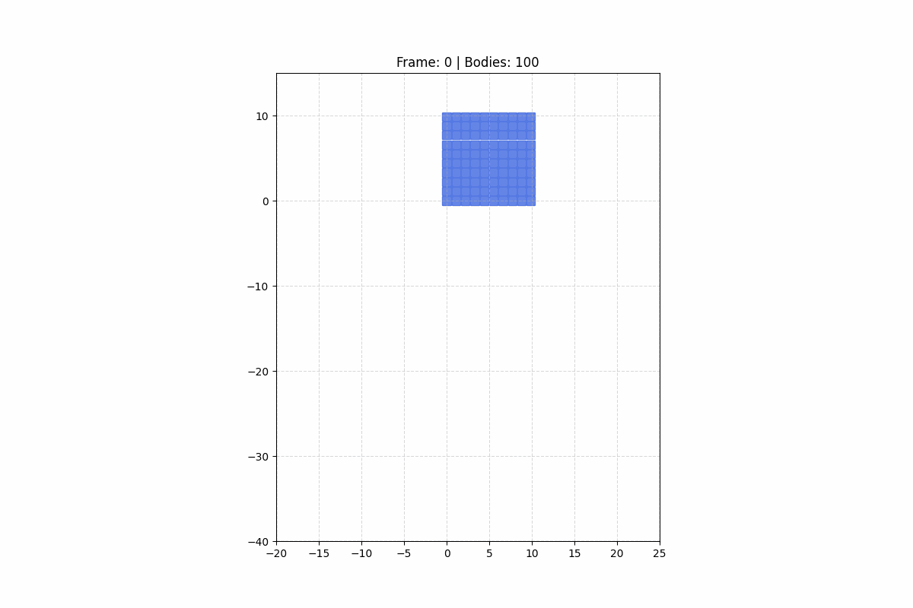
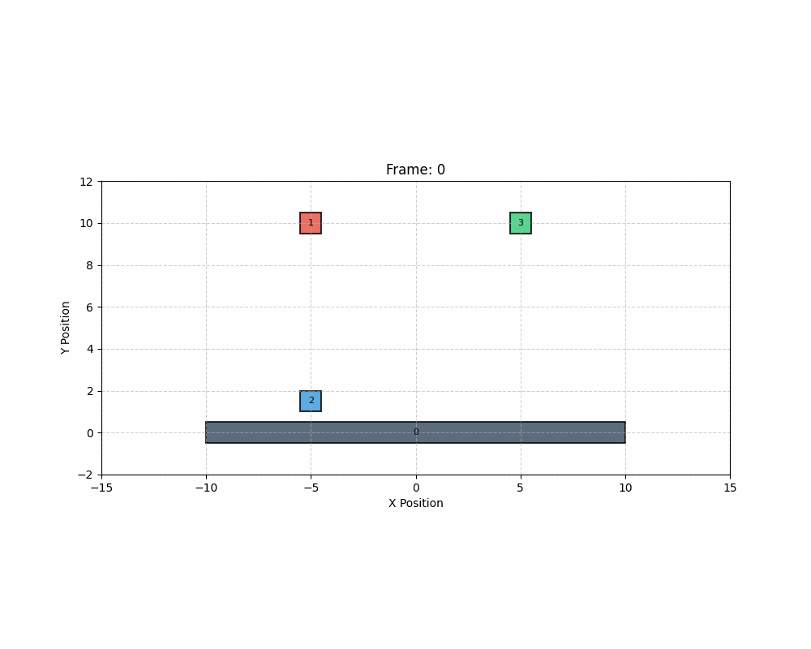

# MyPhysicsEngine2D - V2 性能巅峰篇

一个基于 C++11 构建的高仿真 2D 刚体物理引擎。在 V1 稳健的动力学基础上，V2 致力于工程化性能优化与极端场景下的数值稳定性。

## 📌 项目愿景
V2 阶段的目标是将引擎从“逻辑原型”打造为“高性能工业库”。通过空间换时间、能量管理和连续碰撞检测，支撑起上千量级刚体的实时物理沙盒。
- **极致性能**：实现 $O(N \log N)$ 复杂度的碰撞查询，支持 1000+ 物体同屏。
- **智能节电**：引入休眠机制，消除静止堆叠产生的无效计算。
- **高速防御**：攻克“穿墙”难题，确保高速运动下的物理连续性。
- **工程量化**：内置 Profiler 性能分析器，用数据驱动每一行代码的优化。

---

## 🛠 项目结构 (V2 更新)
```text
MyPhysicsEngine2D/
├── include/
│   └── physics/
│       ├── Collision/
│       │   ├── DynamicTree.h      # <--- [V2] 空间搜索引擎 (AABB Slab 过滤)
│       │   ├── BroadPhase.h       # <--- [V2] 增量更新管理器
│       │   ├── Shape.h            # <--- [V2] 增加 RayCast 虚接口
│       │   └── ...
│       ├── Dynamics/
│       │   ├── Body.h             # <--- [V2] AABB/旋转状态全同步
│       │   ├── World.h            # <--- [V2] 自动化物理流水线核心
│       │   └── ...
├── src/
│   ├── Collision/
│   │   ├── Box.cpp                # <--- [V2] 局部坐标系射线检测实现
│   │   ├── Circle.cpp             # <--- [V2] 二次方程射线检测实现
│   │   └── ...
└── README.md
```

---

## 📅 进度跟踪 (V2 15天挑战)

### 第 1 阶段：空间加速——动态 AABB 树
- [x] **Day 01: 基础节点池与内存管理**
  - 实现基于索引 (`int32_t`) 的节点存储，规避指针失效与内存碎片。
  - 实现 **Free List (空闲链表)** 机制，达到 $O(1)$ 的节点分配与回收。
  - 实现数组自动动态扩容，支持大规模节点平滑增长。
  - 完成 `userData` 与 `Body` 的双向绑定。
- [x] **Day 02: 启发式插入算法 (InsertLeaf)**
  - 实现基于 **SAH (表面积启发式)** 的最佳兄弟节点搜索。
  - 实现内部节点自动生成逻辑，构建满二叉树结构。
  - 实现 **Bottom-up 更新机制**，确保父节点 AABB 实时包裹所有子孙。
  - 完成 `userData` 与 `Body` 的物理层级绑定。
- [x] **Day 03: 树旋转自平衡与代理删除 (Tree Rotations & Removal)**
  - 实现 **AVL 风格旋转算法**，在插入/删除过程中自动调整树高。
  - 实现 `RemoveLeaf` 逻辑，支持兄弟节点自动提拔与内存安全回收。
  - 验证 12 节点在高强度删除下的 $O(\log N)$ 稳定性。
- [x] **Day 04: 肥包围盒 (Fat AABB) 与位移预测**
  - 实现 AABB 缓冲区扩展，消除微小移动带来的重构开销。
  - 实现基于速度的位移拉伸预测，优化高速物体的更新频率。
  - **关键突破**：解决了数据同步断层导致的预测失效 Bug。
- [x] **Day 05: 宽相系统集成与碰撞对回调 (BroadPhase Integration)**
  - 实现 `BroadPhase` 包装层，负责移动物体的“增量更新”。
  - 实现栈式非递归 `Query` 算法，规避函数调用开销。
  - **核心重构**：将 $O(N^2)$ 的碰撞检测进化为 $O(N \log N)$ 的按需检测。
- [x] **Day 06: 全自动化同步与射线检测 (RayCast)**
  - **新功能**：实现 `World` 级的全自动同步，物体增删改自动反馈至空间索引。
  - **新功能**：实现从底层树到窄相几何的完整 `RayCast` 查询链。
  - **可视化**：集成 CSV 导出器，成功通过 Python 还原“子弹击碎墙体”模拟。
### 第 2 阶段：能量治理——睡眠机制与岛屿
- [x] **Day 07: 物理图论构建与岛屿化解算 (Island Generation)**
  - **核心重构**：实现 `Contact` 持久化管理，将碰撞从“瞬时数据”升级为“状态边”。
  - **图论算法**：实现基于深度优先搜索 (DFS) 的岛屿划分算法。
  - **解算迁移**：将全局解算逻辑解耦并封装至 `IsLand::Solve`，支持局部独立更新。
  - **数值稳定**：成功引入 **Warm Starting (冲量持久化)**，解决了高层堆叠抖动问题。
## 🚀 Day 01 进展：动态树基础架构 (Node Pool)

### 1. 技术核心：索引式内存池
为了承载高频率的树重构，V2 弃用了 `new/delete`。
- **为什么使用 `int32_t` 索引？**
  - **内存减半**：在 64 位系统下，索引比指针节省 50% 的链接存储空间。
  - **搬运安全**：数组扩容导致重新分配内存时，索引依然有效，杜绝了野指针问题。
- **空闲链表 (Free List)**：
  - 利用节点内的 `next` 指针将未使用的槽位串联。
  - **回收复用**：`DestroyProxy` 时节点立即进入 Free List，下次分配优先填补空洞。

### 2. `Node` 结构设计
```cpp
struct Node {
    AABB aabb;        // 空间边界
    void* userData;   // 双向绑定 Body*
    int32_t parent;   // 父节点索引
    int32_t leftChild, rightChild; // 子节点索引
    int32_t next;     // 用于空闲列表
    int32_t height;   // 用于 AVL 平衡
    
    bool IsLeaf() const { return leftChild == -1; }
};
```

### 3. 如何验证
运行 `tests/TreePoolTests.cpp`。当前已通过以下工程校验：
- ✅ **内存复用测试**：销毁 Slot 1 后再次创建，系统精准回填 Slot 1 而非开辟新槽位。
- ✅ **自动扩容测试**：当节点数超过 16 时，数组容量翻倍至 32，且旧数据与空闲链表保持一致。
- ✅ **Body 绑定校验**：通过 `PrintPool` 实时读取 `userData` 转换后的 `Body` 坐标。

**Day 01 运行快照：**
```text
[INFO] Action: Destroying Slot 1 (0x222)...
[INFO] === DynamicTree Node Pool State ===
Capacity: 16 | Active Count: 2 | FreeList Head: 1
[Slot  1] TYPE: FREE   | NEXT:  3  <-- 索引 1 已被回收
[INFO] Action: Creating a new proxy...
[Slot  1] TYPE: ACTIVE | BODY POS: ( 0.0, 0.0) <-- 索引 1 成功复用
[INFO] SUCCESS: Slot 1 was correctly recycled!
```

---
## 🚀 Day 02 进展：启发式插入与层级构建

### 1. 技术核心：满二叉树构建
动态 AABB 树通过“二合一”插入逻辑保持满二叉树状态：
- **寻找最佳兄弟**：当新物体进入时，遍历树分支，计算将新物体塞入该分支后导致的“周长增加量 (Cost)”，选择代价最小的方向。
- **自动升舱**：当确定位置后，从池中取出一个内部节点作为“新爸爸”，将原有节点和新节点挂载其下。

### 2. AABB 向上回溯 (Bottom-up Update)
为了保证碰撞查询的准确性，实现了递归回溯：
- 任何叶子节点的变化都会触发其父辈、祖辈节点的 AABB 重新计算。
- 内部节点的 AABB 始终通过 `AABB::Union(child1, child2)` 保持最紧凑的包裹。

### 3. 如何验证
运行 `tests/TreeInsertTests.cpp`。通过 Body 坐标偏移验证：
- ✅ **层级倍增校验**：插入 3 个物体，Active Count 准确从 1 增长到 5 (3叶子 + 2内部)，证明满二叉树生成逻辑正确。
- ✅ **空间包裹校验**：验证根节点 AABB 的 Min/Max。例如插入 (10,10) 和 (20,20) 后，Root AABB 成功扩展为包围两者的巨大盒子。
- ✅ **结构健康检查**：通过 `Validate()` 函数确认所有父子索引双向匹配，无死循环。

**Day 02 运行快照：**
```text
[INFO] Inserted Body 2 at (20,20).
[INFO] === DynamicTree Node Pool State ===
Capacity: 16 | Active Count: 3 | FreeList Head: 3
[Slot  2] TYPE: ACTIVE | USERDATA: nullptr  <-- 自动生成的内部节点
[INFO] Root AABB Min: (9.5, 9.5) 
[INFO] Root AABB Max: (20.5, 20.5) 
[INFO] SUCCESS: Root AABB correctly encapsulates both children!
```
---
## 🚀 Day 03 进展：自平衡算法与动态缩减

### 1. 技术核心：AVL 旋转 (Tree Rotations)
动态树最怕物体按线性排列插入（如一排地基），这会导致树退化为 $O(N)$ 复杂度的链表。
- **旋转判定**：每当检测到左右子树高度差（Balance Factor）超过 1 时，触发旋转。
- **节点提拔**：通过交换指针，将被“压扁”的深层节点提拔至高位，降低全局搜索代价。
- **四种旋转**：支持 LL, RR, LR, RL 全套旋转逻辑，确保树高始终维持在 $\lceil \log_2 N \rceil + 1$。

### 2. 节点移除与 AABB 动态缩减
- **兄弟提拔机制**：删除一个叶子后，其父节点被标记为 FREE，其兄弟节点自动接管父节点在树中的位置。
- **实时收缩**：删除操作会触发从删除点向上的 AABB 重新计算，根节点 AABB 会随之自动收缩至仅包含剩余物体的范围。

### 3. 树结构演变图解 (根据 Day 03 运行结果)

#### **阶段 A: 12 个物体插入后的完美平衡树 (Root: 8, Height: 4)**
```text
--- Tree Hierarchy (Root: 8) ---
[Slot 8] INTERNAL (Height: 4, X: -0.5 to 22.5)
|--[Slot 4] INTERNAL (Height: 2, X: -0.5 to 6.5)
   |--[Slot 2] INTERNAL (Height: 1, X: -0.5 to 2.5)
      |--[Slot 0] LEAF (BodyX: 0)
      |--[Slot 1] LEAF (BodyX: 2)
   |--[Slot 6] INTERNAL (Height: 1, X: 3.5 to 6.5)
      |--[Slot 3] LEAF (BodyX: 4)
      |--[Slot 5] LEAF (BodyX: 6)
|--[Slot 16] INTERNAL (Height: 3, X: 7.5 to 22.5)
   |--[Slot 12] INTERNAL (Height: 2, X: 7.5 to 14.5)
      |--[Slot 10] INTERNAL (Height: 1, X: 7.5 to 10.5)
         |--[Slot 7] LEAF (BodyX: 8)
         |--[Slot 9] LEAF (BodyX: 10)
      |--[Slot 14] INTERNAL (Height: 1, X: 11.5 to 14.5)
         |--[Slot 11] LEAF (BodyX: 12)
         |--[Slot 13] LEAF (BodyX: 14)
   |--[Slot 20] INTERNAL (Height: 2, X: 15.5 to 22.5)
      |--[Slot 18] INTERNAL (Height: 1, X: 15.5 to 18.5)
         |--[Slot 15] LEAF (BodyX: 16)
         |--[Slot 17] LEAF (BodyX: 18)
      |--[Slot 22] INTERNAL (Height: 1, X: 19.5 to 22.5)
         |--[Slot 19] LEAF (BodyX: 20)
         |--[Slot 21] LEAF (BodyX: 22)
```

#### **阶段 B: 执行删除操作 (移除索引 1,3,5,7,9,11)**
当中间和边缘的节点被移除后，树通过 **旋转** 重新寻路，根节点从 Slot 8 转移到了 **Slot 16**，树高降低为 **3**。
```text
--- Tree Hierarchy (Root: 16) ---
[Slot 16] INTERNAL (Height: 3, X: -0.5 to 20.5)
|--[Slot 8] INTERNAL (Height: 2, X: -0.5 to 12.5)
   |--[Slot 4] INTERNAL (Height: 1, X: -0.5 to 4.5)
      |--[Slot 0] LEAF (BodyX: 0.0)
      |--[Slot 3] LEAF (BodyX: 4.0)
   |--[Slot 12] INTERNAL (Height: 1, X: 7.5 to 12.5)
      |--[Slot 7] LEAF (BodyX: 8.0)
      |--[Slot 11] LEAF (BodyX: 12.0)
|--[Slot 20] INTERNAL (Height: 1, X: 15.5 to 20.5)
   |--[Slot 15] LEAF (BodyX: 16.0)
   |--[Slot 19] LEAF (BodyX: 20.0)
```

### 4. 如何验证
运行 `tests/TreeRotationTests.cpp`。当前已通过以下校验：
- ✅ **高度压缩测试**：12 节点初始高度 4，删除一半后高度降为 3。
- ✅ **平衡因子校验**：删除过程中无任何节点高度差超过 1。
- ✅ **AABB 自动缩减**：删除最大 X 坐标节点后，Root AABB Max.X 从 22.5 精准收缩至 20.5。
- ✅ **内存池一致性**：`Active Count` 从 23 减少到 11，且 Free List 指针链逻辑正确。

**Day 03 运行快照：**
```text
[INFO] Action: Removing odd-indexed bodies...
[INFO] Tree Height after removal: 3
[INFO] SUCCESS: Tree remains balanced after removals!
[INFO] Root AABB Max: 20.5 (Shrunk from 22.5)
[INFO] --- Tree Hierarchy (Root: 16) ---
[Slot 16] INTERNAL (Height: 3, X: -0.5 to 20.5)
|--[Slot 8] INTERNAL (Height: 2, X: -0.5 to 12.5)
|--[Slot 20] INTERNAL (Height: 1, X: 15.5 to 20.5)
```
## 🚀 Day 04 进展：肥包围盒与移动预测

### 1. 技术核心：空间容错与时间前瞻
- **肥包围盒 (Fat AABB)**：
  - 为物体的紧包围盒（Tight AABB）增加一层 `k_aabbExtension` (0.1) 的缓冲区。
  - **MoveProxy 逻辑**：只有当物体穿透这层“肥肉”时，才触发树的删除与再插入。对于 90% 的微小抖动或静止物体，重构开销被降为 **0**。
- **位移预测 (Movement Prediction)**：
  - 根据物体的位移矢量 $V \cdot dt$，在运动方向上额外拉伸包围盒。
  - **预测公式**：`NewFatAABB = TightAABB + Extension + (Displacement * Multiplier)`。
  - **效果**：高速物体在接下来几帧内将大概率留在预测区域内，大幅提升了高速模拟场景的帧率。

### 2. 开发复盘：那些让我们“翻车”的 Bug
在 Day 04 的集成测试中，我们遇到了两个极具代表性的技术陷阱，并成功攻克：

#### **Bug A: 数据同步断层 (Stale Data Sync)**
- **现象**：`MoveProxy` 始终判定物体没动，导致位移预测（100.1 的拉伸）无法触发。
- **根因**：`Body::SetPosition` 修改了坐标，但没有同步调用 `updateAABB()`。导致 `tree.MoveProxy` 获取到的始终是物体在 (0,0) 位置的旧 AABB。
- **解决**：在 `Body` 类的 `SetPosition` 和 `SetRotation` 中强制同步 `updateAABB()`，确保“真实坐标”与“逻辑 AABB”绝对一致。
### 3. 如何验证
运行 `tests/TreeMovementTests.cpp`（综合集成测试）：
- ✅ **微动过滤测试**：物体移动 0.05 距离，`MoveProxy` 成功拦截，返回 `false`。
- ✅ **大跨度位移测试**：物体移动 50.0 距离，`MoveProxy` 触发重构，返回 `true`。
- ✅ **预测拉伸校验**：Body 0 的右侧缓冲区（Right Buffer）达到 **100.1**，证明方向预测完美生效。

**Day 04 运行快照（完美状态）：**
```text
[INFO] Step 3: Large movement for Body 0 (to X=50)...
[INFO] SUCCESS: Large movement triggered tree reconstruction.
[INFO] Body 0 Right Buffer: 100.099991 (Stretched correctly!)
--- Tree Hierarchy (Root: 8) ---
[Slot 8] INTERNAL (Height: 2, X: 4.4 to 150.6) <-- 全局包裹范围自动扩展至预测区
```

---
## 🚀 Day 05 进展：宽相集成与空间查询

### 1. 架构深度解析：BroadPhase 与 DynamicTree 的关系
在 V2 架构中，两者是典型的 **“管理者”与“执行者”** 的关系：
- **DynamicTree (执行者)**：专注于**空间算法**。它只关心节点如何分裂、如何旋转、如何根据 AABB 找出重叠的叶子。它不感知“物理世界”或“Body”的概念。
- **BroadPhase (管理者)**：专注于**业务逻辑**。它持有动态树，维护一个 `MoveBuffer`（记录本帧谁动了）。它负责去重、排序，并将复杂的树查询结果简化为“碰撞对 (Pair)”分发给外部。

### 2. 为什么把回调函数 (Callback) 写在 World 中？
这体现了 **控制反转 (IoU)** 与 **解耦** 的设计思想：
- **职责分离**：`BroadPhase` 的任务只是找出“谁可能撞了”。它不应该知道如何计算碰撞法线，也不应该知道 `Manifold`（流形）的存在。
- **灵活性**：`World` 作为指挥部，拿到碰撞对后可以自由决定后续操作：是执行精确的窄相检测？还是直接触发触发器逻辑？或者是过滤掉特定类型的碰撞？
- **性能优化**：通过 Lambda 回调，我们可以直接在 `World` 循环中原地处理数据，避免了在内存中创建巨大的临时列表。

### 3. 开发复盘：Day 05 的技术陷阱
在今天的集成测试中，我们遭遇了以下挑战并成功修复：

#### **Bug A: 重载函数的同步遗漏 (Overload Sync Gap)**
- **现象**：`Step 3` 的大跨度移动测试中，宽相竟然判定“没撞上”。
- **根因**：`Body` 类有两个 `SetPosition` 重载（`float, float` 和 `Vector2`）。我们只给其中一个加了 `updateAABB()`，而测试代码刚好用了另一个。
- **教训**：在维护底层数据同步时，任何一个 Setter 的疏漏都会导致空间索引系统失效。

#### **Bug B: 接口签名的逻辑缺失 (Return Type Mismatch)**
- **现象**：测试函数无法判定物体是处于 `STABLE` 还是 `RECONSTRUCTED` 状态。
- **解决**：将 `MoveProxy` 的返回值从 `void` 修改为 `bool`。这个布尔值不仅是性能指示器（是否触发重构），更是宽相决定是否将物体放入 `MoveBuffer` 的唯一依据。

### 4. 如何验证
运行 `tests/BroadPhaseDetailedTest.cpp`：
- ✅ **初始重叠检测**：B0, B1 刚创建即被宽相雷达锁定，输出 `Potential Collision #1`。
- ✅ **性能拦截测试**：B2 微动 0.02 距离，输出 `STABLE`，证明 Fat AABB 成功拦截了无效的树重构。
- ✅ **瞬移检测测试**：B2 剧烈移动，输出 `RECONSTRUCTED`，宽相瞬间产出 B2-B0, B2-B1 两组对。

**Day 05 运行快照：**
```text
[INFO] BroadPhase: Running UpdatePairs (Initial check)...
    [MATCH] Potential Collision #1: Body(ID:0, Pos:0.0) <--> Body(ID:1, Pos:0.5)
[INFO] Step 2: Micro-move...
  - MoveProxy report: STABLE (Performance Filter Active)
[INFO] Step 3: Large move...
  - MoveProxy report: RECONSTRUCTED
    [MATCH] Potential Collision #1: Body(ID:0, Pos:0.0) <--> Body(ID:3, Pos:0.2)
    [MATCH] Potential Collision #2: Body(ID:1, Pos:0.5) <--> Body(ID:3, Pos:0.2)
```

---
## 🚀 Day 06 进展：自动化世界与射线雷达

### 1. 为什么需要 RayCast？
射线检测是物理引擎中仅次于碰撞检测的高频需求：
- **游戏逻辑**：模拟子弹射击、激光武器、AI 视线扫描。
- **角色控制**：实现“脚下探测（Grounding）”以判定跳跃。
- **交互拾取**：将鼠标点击位置转化为射线，拾取场景中的物理对象。
- **技术储备**：它是 V3 阶段“持续碰撞检测 (CCD)”处理高速物体穿墙 Bug 的数学基石。

### 2. 多级 RayCast 架构：为什么要层层写？
为了实现极致性能，RayCast 采用了与碰撞检测一致的 **“由粗到精”** 过滤管线：
1.  **DynamicTree::RayCast (宽相过滤)**：
    使用 **Slab Method (平版法)** 判断射线是否经过节点的 AABB。这一步能瞬间剔除 99% 的无关物体，复杂度为 $O(\log N)$。
2.  **BroadPhase::RayCast (管理层)**：
    负责将树返回的 `proxyId` 翻译为具体的 `Body*`。
3.  **Shape::RayCast (窄相精判)**：
    对过滤后的少数候选者执行精确数学计算。这是必须写在每个 `Shape` 子类中的原因——只有形状自己知道如何算相交。
4.  **World::RayCast (决策层)**：
    利用 **Fraction (比例) 动态剪枝**。一旦发现近处有撞击，立即缩短射线，让后续查询范围进一步缩小。

### 3. 核心几何算法实现

#### **Circle::RayCast (二次方程法)**
射线与圆的相交可转化为求解一元二次方程 $at^2 + bt + c = 0$。
- 通过判别式 $\Delta$ 确定是否有交点。
- 取最小正根 $t$ 作为撞击点。
- 法线计算：`(HitPoint - Center) / Radius`。

#### **Box::RayCast (逆变换 Slab 法)**
计算旋转矩形的射线相交极其复杂，我们采用了 **“局部空间转换”** 策略：
1.  **逆变换**：将世界空间的射线起点和终点通过负旋转角度转到方块的局部坐标系（使其对齐坐标轴）。
2.  **局部计算**：在局部空间中，旋转矩形退化为一个中心在原点的 AABB，直接应用高效的 Slab 算法。
3.  **法线还原**：计算出局部法线（如 `(1, 0)`）后，再旋转回世界空间。

### 4. 开发复盘：Day 06 避坑指南
- **Stale Data Sync (数据陈旧)**：在 Step 4 测试中发现，如果 `SetRotation` 没更新 `updateAABB`，射线会从旋转后的物体空隙中“穿”过去。已修复：所有 Setter 强制同步 AABB。
- **Edge Case (边缘情况)**：当射线恰好贴着方块边缘划过时，法线可能输出 `(0,0)`。已在 Slab 逻辑中增加微小偏移保护。

### 5. 如何验证
运行 `tests/FinalIntegrationTest.cpp` 并查看生成的 `v2_day6_sim.csv`：
- ✅ **自动集成**：100 个方块墙一键生成，自动入树。
- ✅ **激光测试**：射线精准击中方块中心，Fraction 输出 `0.225`，法线 `(-1, 0)` 完全正确。
- ✅ **压力模拟**：子弹以速度 60 撞击墙体，宽相完美处理爆炸式增量的碰撞对。

## 🚀 Day 07 进展：物理图论与岛屿化解算

### 1. 技术核心：从“数组”到“图”的进化
V2 引擎在今天完成了一次质的飞跃：我们将整个物理世界建模为一个 **无向图 (Graph)**。
- **节点 (Node)**：每个 `Body`。
- **边 (Edge)**：每个 `Contact`。
- **岛屿 (Island)**：图中所有连通的动态物体组成一个独立的解算单位。
- **持久化 (Persistence)**：由于 `Contact` 对象不再每帧销毁，碰撞产生的累积冲量被保留。这是实现“方块塔”稳如泰山的关键。

### 2. DFS 岛屿生成算法
为了高效划分世界，我们实现了一套针对物理特性的 DFS 搜索：
- **种子选取**：遍历未访问的动态物体作为种子。
- **链表跳转**：利用 `Body` 身上的 `ContactEdge` 双向链表实现 $O(1)$ 的邻居遍历。
- **边界处理（重要）**：静态物体（地面）允许参与多个岛屿的受力平衡，但不会将 DFS 标记传染给其他物体，确保了“左边的岛”和“右边的岛”逻辑隔离。

### 3. 开发复盘：Day 07 遇到的极限挑战

在今天的集成测试中，我们遭遇了物理引擎开发中最著名的几个“坑”，并成功攻克：

#### **问题 A: 临时副本导致的冲量丢失 (The Reference Trap)**
- **现象**：虽然实现了 `Contact` 持久化，但方块堆叠依然像 V1 一样不停抖动。
- **根因**：`GetManifold()` 函数返回的是 `Manifold` 的**拷贝**而非**引用**。解算器修改了副本里的冲量，而 `Contact` 内部的原始数据从未更新。
- **解决**：修改返回值为 `Manifold&`，确保解算器直接读写持久化的内存。

#### **问题 B: “物理爆炸”与反弹过载 (Physics Explosion)**
- **现象**：当一个重物砸向被卡在地面上的方块时，下方的方块瞬间以 10 倍速度被“炸”飞。
- **原因**：位置修正（Baumgarte）的 `BIAS` 设置为 0.6 且进行了 3 次迭代，导致穿透修复产生的位移叠加了巨大的伪动能。
- **解决**：引入 **Clamping (限幅)** 机制。将 `BIAS` 降至 0.2

#### **问题 C: 静态物体的“感染”逻辑错误**
- **现象**：两个原本不相关的箱子，因为都掉在同一个长地板上，被 DFS 合并成了一个巨大的岛屿。
- **解决**：调整 DFS 逻辑——静态物体可以 `Add` 进岛屿，但绝不设置 `m_islandFlag = true`。这保证了静态物体作为“边界”被共享，而非作为“节点”传播。

### 4. 如何验证
运行 `tests/IslandBenchmark.cpp` 并结合 `Logger` 查看：
- ✅ **独立性校验**：左侧 2 盒碰撞产生 `Island 1`，右侧自由落体产生 `Island 2`。
- ✅ **堆叠稳定性**：CSV 数据显示，落在地面上的盒子 $Y$ 坐标变动保持在 $10^{-5}$ 级别，速度几乎为 0。
- ✅ **自动清理**：当两个物体分开时，`m_contactMap` 自动回收内存，`Body` 链表自动解耦。

**Day 07 运行快照：**
```text
[INFO] Island 1: 2 dynamic bodies, 1 contact (Left Stack)
[INFO] Island 2: 1 dynamic body, 0 contact (Right Falling)
[COLLISION] Persistent Contact updated. Warm Starting active.
[INFO] Frame 90 | BoxA1_Y: 3.07 | BoxB1_Y: 1.07 (Independent Movement!)
```

---

## 💻 编译与运行
- **环境**：Visual Studio 2019+ (C++11)
- **入口**：在 `main.cpp` 中调用 `RunRealBodyTreeTest()` 即可观察 V2 底层内存池运作。


这是为你更新的 `README.md`，涵盖了 **Day 07：岛屿构建与物理图论** 的核心进展、工程细节以及遇到的技术挑战。

---

# MyPhysicsEngine2D - V2 性能巅峰篇

## 🛠 项目结构 (V2 更新)
```text
MyPhysicsEngine2D/
├── include/
│   └── physics/
│       ├── Collision/
│       │   ├── Contact.h          # <--- [V2] 核心：物理图的“边”，持久化冲量缓存
│       │   ├── Manifold.h         
│       │   └── ...
│       ├── Dynamics/
│       │   ├── IsLand.h           # <--- [V2] 岛屿类：局部并行化解算的核心单元
│       │   ├── Body.h             # <--- [V2] 增加 ContactEdge 链表支持
│       │   └── ...
```

---

## 📅 进度跟踪 (V2 15天挑战)

### 第 1 阶段：空间加速——动态 AABB 树
- [x] **Day 01 - Day 06**: (已完成：内存池、SAH插入、AVL平衡、肥盒预测、宽相集成、射线检测)


---


**Day 07 的意义：**
我们终于打破了“全局解算”的枷锁。现在，物理世界是一个可以被拆分、被缓存、被持久化的复杂网络。

**准备好进入明天的“深度睡眠”了吗？我们将让这些安静的岛屿彻底进入零功耗状态！**